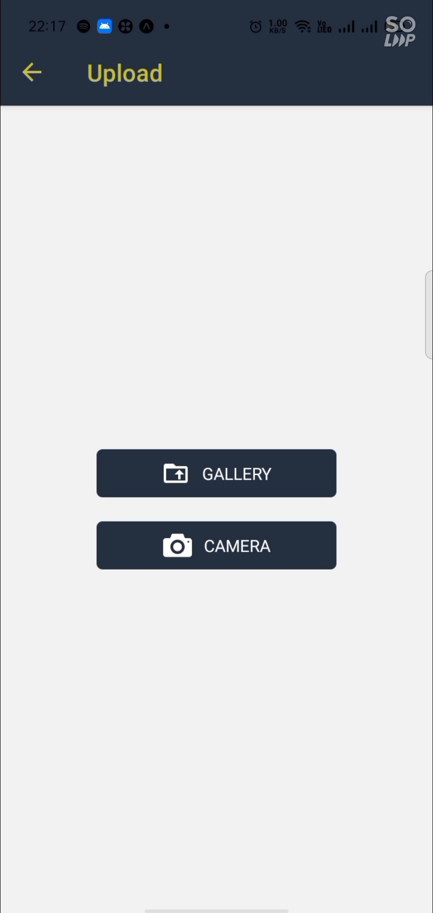

# PHOTOAPP

Demo Video : https://drive.google.com/file/d/11KexoyrjjrNejqJ2I8p-xYCWGAZpMNUf/view?usp=sharing

Description: 
In this app user selects an image or takes a photo which is saved (intended to be saved) to a localstorage (localhost).
The user can then view the saved the images from the app (Functions kinda like Google Photos).
Firebase is used to do the signin and signout authentications.

Frontend: React-Native
Backend Server: NodeJS, Express, and a JSON file to store info of every update.

To connect this frontend to the backend server I utitlized the axios module.

To build this app I used an Expo SDK module known as ImagePicker (check it out: https://docs.expo.io/versions/v41.0.0/sdk/imagepicker/).
Also React Navigation is used to create screens.
I Also used a module known as react-native-textarea (check it out: https://www.npmjs.com/package/react-native-textarea).

Check the PackagesInstalled.txt to know about all additional modules used.